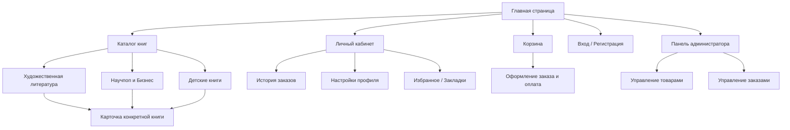

# Технические спецификации проекта
### Информационная архитектура книжного интернет-магазина

```mermaid
graph TD
    %% Главная страница
    Main[Главная страница]
    
    %% Второй уровень страниц
    Catalog[Каталог книг]
    Profile[Личный кабинет]
    Cart[Корзина]
    Auth[Вход / Регистрация]
    AdminPanel[Панель администратора]
    
    %% Связи второго уровня
    Main --> Catalog
    Main --> Profile
    Main --> Cart
    Main --> Auth
    Main --> AdminPanel

    %% Третий уровень: Каталог и Жанры
    Genre1[Художественная литература]
    Genre2[Научпоп и Бизнес]
    Genre3[Детские книги]
    BookCard[Карточка конкретной книги]

    Catalog --> Genre1
    Catalog --> Genre2
    Catalog --> Genre3
    
    Genre1 --> BookCard
    Genre2 --> BookCard
    Genre3 --> BookCard

    %% Третий уровень: Личный кабинет
    Orders[История заказов]
    Settings[Настройки профиля]
    Favorites[Избранное / Закладки]

    Profile --> Orders
    Profile --> Settings
    Profile --> Favorites

    %% Третий уровень: Корзина
    Checkout[Оформление заказа и оплата]
    
    Cart --> Checkout

    %% Третий уровень: Админка
    ManageBooks[Управление товарами]
    ManageOrders[Управление заказами]

    AdminPanel --> ManageBooks
    AdminPanel --> ManageOrders
```
