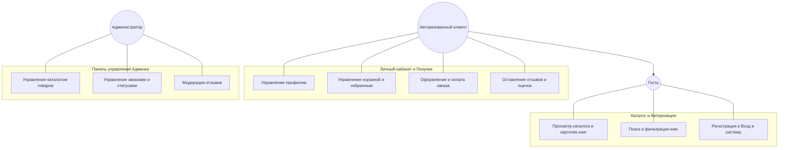

# Технические спецификации проекта

```mermaid
graph TD
    %% Определение пользователей (Акторов)
    Guest((Гость))
    Client((Авторизованный клиент))
    Admin((Администратор))

    %% Наследование ролей
    Client --> Guest

    %% Прецеденты для Гостя
    subgraph Каталог и Авторизация
        UC_Browse[Просмотр каталога и карточек книг]
        UC_Search[Поиск и фильтрация книг]
        UC_Auth[Регистрация и Вход в систему]
    end

    %% Прецеденты для Клиента
    subgraph Личный кабинет и Покупки
        UC_Profile[Управление профилем]
        UC_Cart[Управление корзиной и избранным]
        UC_Order[Оформление и оплата заказа]
        UC_Review[Оставление отзывов и оценок]
    end

    %% Прецеденты для Админа
    subgraph Панель управления Админка
        UC_ManageCatalog[Управление каталогом товаров]
        UC_ManageOrders[Управление заказами и статусами]
        UC_Moderate[Модерация отзывов]
    end

    %% Связи Акторов с прецедентами
    Guest --- UC_Browse
    Guest --- UC_Search
    Guest --- UC_Auth

    Client --- UC_Profile
    Client --- UC_Cart
    Client --- UC_Order
    Client --- UC_Review

    Admin --- UC_ManageCatalog
    Admin --- UC_ManageOrders
    Admin --- UC_Moderate
```
