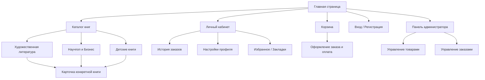
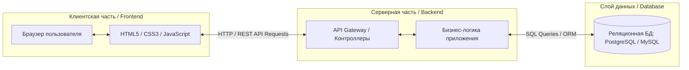

# Технические спецификации проекта
### Информационная архитектура книжного интернет-магазина

### Программная архитектура веб-приложения

Для книжного интернет-магазина спроектирована классическая трехзвенная архитектура (Client-Server-Database), которая разделяет интерфейс пользователя, бизнес-логику и хранение данных.

**Описание слоев:**
1. **Frontend (Клиентский слой):** Работает в браузере пользователя. Отвечает за отображение страниц каталога, макетов, корзины и интерфейса администрирования. Строится на технологиях HTML5, CSS3 и JavaScript.
2. **Backend (Серверный слой):** Сердце приложения. Принимает запросы от клиента, обрабатывает логику оформления заказов, проверяет пароли при авторизации и управляет каталогом книг.
3. **Database (Слой данных):** База данных, где надежно хранятся все сведения: таблицы пользователей, каталог книг (названия, авторы, цены, остатки на складе) и оформленные заказы.
